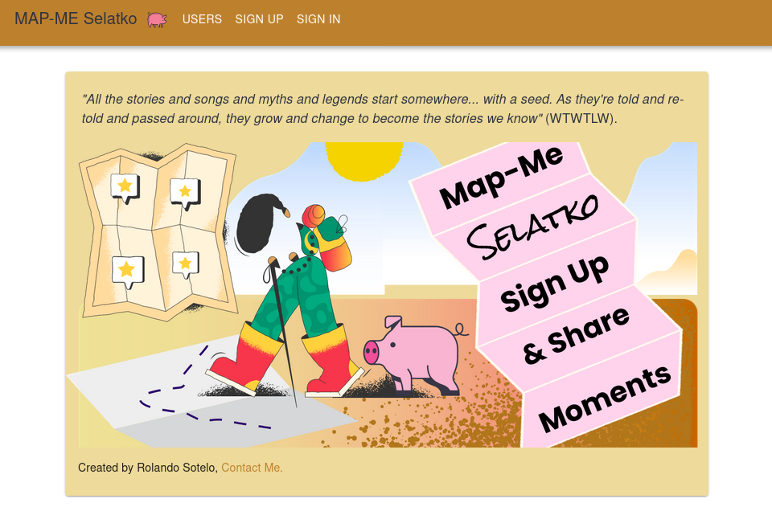
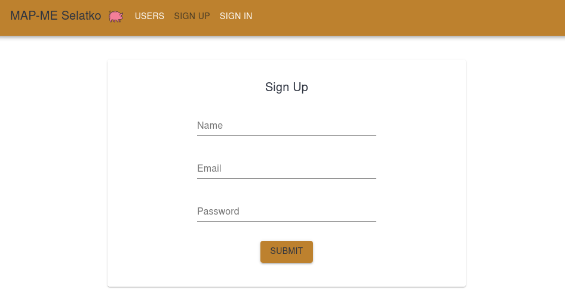
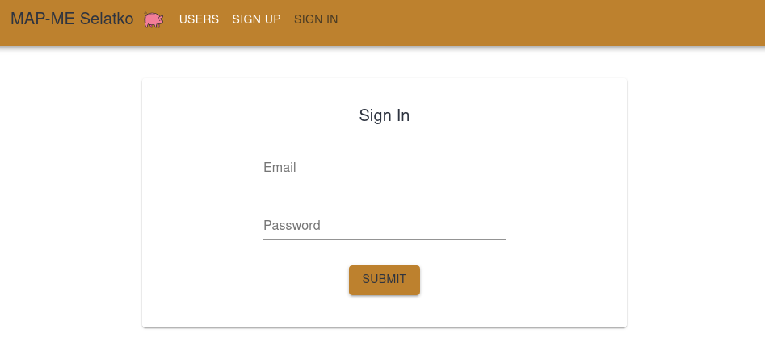
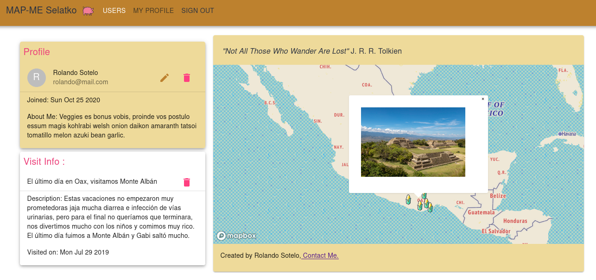

# 

# Map-Me Selatko  

<table>
<tr>
<td>
  A Web Application for logging visits in a map and sharing them with friends. RESTful API with CRUDL and auth implementations (MERN stack).

</td>
</tr>
</table>

## Demo
Here is a working live demo :  https://selatko-map-me.herokuapp.com/

## Site

### Sign up and Sign in pages
Before being able to visit other user's maps, you will need to sign up and sign in into Map-Me Selatko. Once authenticated you can visit every profile and mess around with your own map.

# 
# 

### Profile page
The Profile page is where you will be able to create new visits if it's your own profile (if you are authorized) and/or display the info for every visit (if you are authenticated).

## Understanding selatko-map-me

* A Pin in Map-Me Selatko represents a Visit to that exact location at the specified date. A description and image can be aditionaly specified.

* Visits are visible to every user authenticated.

* One can only Edit and Delete entries from its own profile. 

* Delete and Edit functionaly for user profiles are also recerved to the owner of the profile.

## Usage
* Once repo is cloned
* `npm run install`
* `npm run start-dev`

## License
MIT © [Rolando Sotelo](https://github.com/soteloalarco)